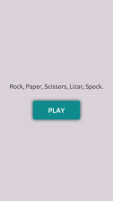
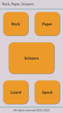
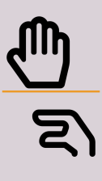
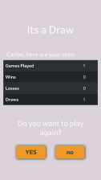
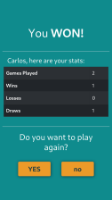
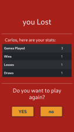

# Rock, Paper, Scissors! :joystick:

Game of rock, paper, scissors built for the first week at School of Code.

Visit [live site](https://webshuriken.github.io/SoC-week1-hackathon) :airplane:


## Features

- Responsive
- extra 2 moves: lizard, spock.


## Screenshots









## Color Reference

| Color             | Hex                                                                |
| ----------------- | ------------------------------------------------------------------ |
| Timberwolf |  #DAD2D8 |
| Gunmetal |  #143642 |
| Dark Cyan |  #0F8B8D |
| Gamboge |  #EC9A29 |
| Cornell Red |  #A8201A |


## Tech Stack

**Client:** HTML5, JS, Bootstrap5


## Instructions to create the text base game

### Task 1: Logic :heavy_check_mark:

To complete this ticket you will need to write a set of if statements that will determine the winner of rock, paper, scissors. 

The two moves should be stored in two variables like so:

```js
let playerMove = "rock";
let computerMove = "paper";
```

You'll want to hard-code each move in these variables (like the example above) to check each piece of logic at first. 

This will be deemed as complete when all permutations of the three possible moves for each player have been handled correctly, e.g. rock vs rock is a draw, paper vs rock is a paper win, etc.


### Task 2: Function :heavy_check_mark:

Take the if statements that you've written and tested and put them into a function. The variables from before should now be taken in as parameters so that you can call the function with any two moves. Instead of printing the result to the console, the function should return:

- `1` if player1 wins
- `0` if it is a draw
- `-1` if player1 loses (player2 wins)

The function should be able to be used like so:

```js
function getWinner(player1, player2) {
  // code goes here...
}

let result = getWinner("rock", "paper");
```

This will be deemed as complete when the function can be called with any combination of valid moves and returns the appropriate number.


### Task 3: User Input :heavy_check_mark:

Using `prompt`, get a user-inputted value for the player move. Then call your function with that value as the player move and the hard-coded computer move. Display the result using `alert`.

This will be deemed as complete when you can input any move for the player move and hard-code any move for the computer move and see the correct result (1, 0, or -1) in the alert.


### Task 4: Computer Player :heavy_check_mark:

Write a function that generates a random computer move. Use that function to make a dynamic game where the computer move is randomly chosen every time instead of being hard-coded.

<details>
<summary>Hint</summary>
`Math.random()` might be useful!
</details>

This will be deemed as complete when the player can input any move in the prompt, the computer move is chosen by random, and the correct result shows in the alert.


### Task 5: Game Loop :heavy_check_mark:

Now that we have a fully functioning game, our next step is to have it run as many times as people would like to play without having to refresh the page.

Use a `while loop` and `confirm`.

This will be deemed as complete when a player can keep playing indefinitely and has the option to stop playing after every round.


### Task 6: Scores :heavy_check_mark:

Keep track of how many games have been played, as well as the number of wins, losses, and draws.

This will be deemed as complete when this information is displayed after each round.


### Task 7: Get the player's name using a prompt :heavy_check_mark:

Create a username `prompt` and use the username the player inputs in the game so that a player can see their name in the messages sent to them.

To make it more uniform, restrict the number of characters a username can be to 10 or fewer.

This will be deemed as complete when the users cannot enter a username longer than 10 characters.

🌟 BONUS: Make it so that valid usernames should only start with letters, not numbers or symbols.  
🌟 EXTRA BONUS: Make it so that the first letter of the username should be capitalised.  


### Bonus task extensions - pick whichever one(s) you fancy

#### Extension 1: Extend the logic :heavy_check_mark:

Rock, paper scissors is now boring. We need to jazz is up a bit.  
Add some more moves that a player can make.  
Check out this example:

  

Modify your logic to represent your new version of this timeless children's game.


#### Extension 2: The Clairvoyant Computer :heavy_check_mark:

How would you go about making the computer win every time?

How would you go about making it so that the computer wins more often (1/2 the time, 1/4 of the time 90% of the time)?

Plan how you'd go about implementing this (use pseudo-code).

If you have time, see if you can start writing this.


## Roadmap

- Graphical Interface.


## Acknowledgements

 - [Coolers](https://awesomeopensource.com/project/elangosundar/awesome-README-templates) for generating a random colour pallet
 
 **Icons** used to represent the different hand gestures.
 
 - [Rock](https://icon-icons.com/icon/hand-rock/194408)
 - [Paper](https://icon-icons.com/icon/hand-paper/194460)
 - [Scissors](https://icon-icons.com/icon/hand-scissors/194407)
 - [Lizard](https://icon-icons.com/icon/hand-lizard/198389)
 - [Spoke](https://icon-icons.com/icon/gesture-hand-spock/218207)


## Authors

- [Carlos E Alford](https://carlosealford.com/)
- [Conor Goddard](https://www.github.com/ConorG1247) worked with me on the inital text version of the game.


## License

[MIT](https://choosealicense.com/licenses/mit/)
