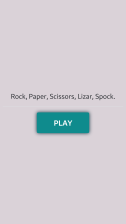
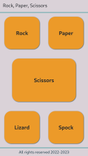
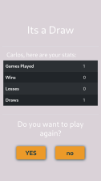
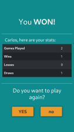
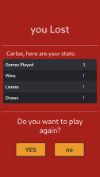
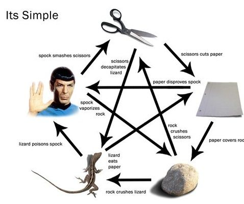

# Rock, Paper, Scissors! :joystick:

Game of rock, paper, scissors built for the first week at School of Code.

:joystick: [Play game](https://webshuriken.github.io/SoC-week1-hackathon)

## About

The first hackathon of many during the School of Code bootcamp. Worked along side Connor to create a text based game of rock, paper scissors. All created in one day. Later on the game was improved and with icons. See [Hackathon notes](HACKATHON.md) to read about the challenge. 

## Tech Stack

- HTML5
- JS
- Bootstrap5

## Run Locally

1. Close the repo `git clone [https://](https://github.com/webshuriken/SoC-week1-hackathon.git)`
2. Open the `index.html` on a browser and off you go!

## Features

- Responsive
- extra 2 moves: lizard, spock.
- Graphical Interface.

## Game rules

## Acknowledgements

 - [Coolers](https://awesomeopensource.com/project/elangosundar/awesome-README-templates) for generating a random colour pallet
 
 **Icons** used to represent the different hand gestures.
 
 - [Rock](https://icon-icons.com/icon/hand-rock/194408)
 - [Paper](https://icon-icons.com/icon/hand-paper/194460)
 - [Scissors](https://icon-icons.com/icon/hand-scissors/194407)
 - [Lizard](https://icon-icons.com/icon/hand-lizard/198389)
 - [Spoke](https://icon-icons.com/icon/gesture-hand-spock/218207)

## Authors

- [Carlos E Alford](https://carlosealford.com/)
- [Conor Goddard](https://www.github.com/ConorG1247) worked with me on the inital text version of the game.

## License

[MIT](LICENSE)
